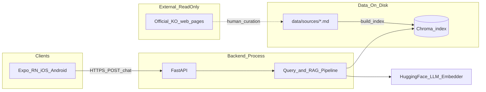
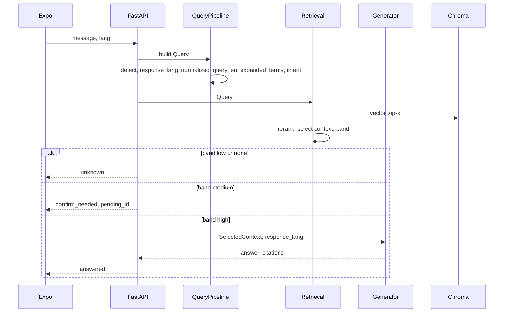

# 아키텍처 계획

**승인 기준일**: 2026-06-02  
**기준**: [domain-modeling.md](./domain-modeling.md) v2, [mvp-scope-planning.md](./mvp-scope-planning.md), [requirements-decomposition.md](./requirements-decomposition.md)  
**범위**: KU **RAG FAQ 챗봇** MVP — Expo + FastAPI + Chroma + HF LLM (무로그인)

---

## 시스템 맥락



**원칙**: `/chat`은 **인덱스된 Korean md**만 읽음. 공식 웹은 citation URL·콘텐츠 작성 참고용 (실시간 fetch 없음).

---

## 아키텍처 결정 (MVP)

| ID | 결정 | 이유 |
|----|------|--------|
| AR-1 | **인덱스 SSOT = human-curated Korean `.md` only** (`translation_strategy=answer_time_translation`) | Domain v2; 별도 en md Must 제거 |
| AR-2 | **English-first 검색**: `normalized_query_en` + `expanded_terms` → embed search | KO 청크 + 다국어 질의 브릿지 |
| AR-3 | **응답**: `response_lang` (UI > detected > en); LLM이 answer-time 다국어 생성 + `preserve_terms` | 별도 en 인덱스 불필요 |
| AR-4 | **Rerank MVP = heuristic** (distance + keyword/제출서류 boost) | 지연·의존성 최소 |
| AR-5 | **Lang detect MVP = `langdetect`** (또는 동급), confidence ≥ **0.70** → detected_lang | 가벼움 |
| AR-6 | **`normalized_query_en`**: en 입력이면 `message` 그대로; 그 외 **1회 짧은 LLM/규칙 번역** (검색 전용, 답변과 분리) | Domain 필드 충족 |
| AR-7 | **Persistence**: Chroma 파일 + PendingSession **in-memory** (TTL); **SQL DB 없음** MVP | Skill 7에서 스키마 최소화 |
| AR-8 | **무로그인**; `/admin/reindex`는 dev/pilot에서 네트워크 제한 권장 | NFR-5 |

> Skill 4 MoSCoW의「ko+en dual md」는 **AR-1로 대체** — [DECISIONS.md](../DECISIONS.md) 참고.

---

## 모듈

### 1. 모바일 (`mobile/`)

| 모듈 | 책임 |
|------|------|
| `App.tsx` / 챗 화면 | 메시지 입력·응답·confirm yes/no |
| `src/api/client.ts` | `POST /chat`, `GET /health`; `lang` 전달 |
| `src/i18n/strings.ts` | ko/en/zh/ja UI (unknown, confirm, errors) |
| `src/openSourceLink.ts` | `citation.source_url` 열기 |

**비책임**: RAG, 인덱싱, 언어 감지 (서버).

---

### 2. API 레이어 (`backend/app/`)

| 엔드포인트 | 책임 |
|------------|------|
| `POST /chat` | ChatTurn 라우팅 (initial vs confirm) |
| `GET /health` | `indexed_chunks`, status |
| `POST /admin/reindex` | `build_index(force=True)` |

| 컴포넌트 | 책임 |
|----------|------|
| `main.py` | lifespan: index warm-up, Retriever 싱글톤, CORS |
| Pydantic schemas | `ChatRequest`, `ChatResponse`, `Citation` — domain과 1:1 |

---

### 3. Query 파이프라인 (`backend/rag/query/` — 신규·분리 권장)

| 모듈 | 입력 → 출력 | 설명 |
|------|-------------|------|
| `language_detect` | `message` → `detected_lang`, `confidence` | `langdetect`; 실패 시 `en`, confidence=0 |
| `response_lang_resolver` | UI `lang`, detected → `response_lang` | Domain DR-4.2 |
| `query_normalizer` | `message`, `detected_lang` → `normalized_query_en` | en이면 copy; 아니면 검색 전용 en 변환 (AR-6) |
| `intent` | `message` → `intent`, `ambiguity_level` | 기존 `intent.py` 확장 |
| `term_expander` | `intent`, `message`, optional doc hints → `expanded_terms[]` | 규칙표 + 한국어 행정어 ([`term_expansion.yaml`](../../backend/rag/data/term_expansion.yaml) 등) |
| `query_builder` | 위 필드 → `Query` dataclass | 단일 진입 |

**`expanded_terms` 예 (document_list)**  
`제출서류`, `필요 서류`, `외국인등록`, `신청 서류`

**`normalized_query_en` 예**  
`message`: 「외국인등록증 뭐 필요해」 → `What documents are required for alien registration?`

---

### 4. 인덱싱 (`backend/rag/index/`)

| 모듈 | 책임 |
|------|------|
| `frontmatter` | SourceDocument 메타 파싱 (`doc_id`, `preserve_terms`, `sensitive_topic`, …) |
| `chunking` | `##`, `다./나.` 절 분할 → Chunk |
| `indexer` | md 스캔 → embed → Chroma `add`; 메타 denormalize |
| `scripts/build_index.py` | CLI reindex |

**경로**: `backend/data/sources/**/*.md`  
**스크립트 `ingest_urls.py`**: Non-Scope for `/chat`; 선택적 md 초안 생성만.

---

### 5. 검색(Retrieval) (`backend/rag/retrieval/`)

| 모듈 | 책임 |
|------|------|
| `embedder` | `sentence-transformers/paraphrase-multilingual-MiniLM-L12-v2` (싱글톤) |
| `search_text_builder` | `normalized_query_en` + space + `join(expanded_terms)` → embedding 입력 |
| `chroma_store` | `query` top-k, cosine distance |
| `reranker` | Heuristic: distance ↑, `expanded_terms` substring in chunk ↑, `document_list` + `제출서류` ↑ |
| `banding` | `DISTANCE_HIGH_MAX` / `LOW_MAX` → RelevanceBand |
| `context_selector` | top **4** chunks → `SelectedContext` (LLM budget) |

**출력**: `RetrievalResult` (vector_search, rerank, selected_context, band).

---

### 6. 생성(Generation) (`backend/rag/generation/`)

| 모듈 | 책임 |
|------|------|
| `model_loader` | HF Qwen2.5-1.5B-Instruct (기본), 4bit CUDA / MPS fp16 |
| `generator` | SelectedContext + `response_lang` + intent hints → answer; `__UNKNOWN__` |
| `prompt_policy` | preserve_terms, SensitiveTopic 톤, DR-1.5 (no invented deadlines/fees) |
| `safety` | `SafetyNotice`, `SuggestedContact` 템플릿 (민감 주제 시) |
| `answer_composer` | unknown/confirm 고정 문구 (i18n 키와 정합) |

---

### 7. 세션 (`backend/rag/session/`)

| 모듈 | 책임 |
|------|------|
| `pending_sessions` | `pending_id` → Query + SelectedContext 스냅샷, TTL 600s |

---

### 8. 설정 (`backend/rag/config.py`)

| 변수 | 용도 |
|------|------|
| `MODEL_ID`, `EMBEDDING_MODEL`, `TOP_K` | 모델·검색 |
| `DISTANCE_HIGH_MAX`, `DISTANCE_LOW_MAX` | 밴드 |
| `LANG_DETECT_MIN_CONFIDENCE` | 0.70 (신규) |
| `LOAD_IN_4BIT` | CUDA |

---

## 데이터 흐름

### A. 오프라인 — 인덱스 구축

```text
공식 KO 웹 (참고)
  → 사람이 작성/갱신: data/sources/{category}/{doc_id}_ko.md
  → frontmatter + Korean body
  → chunk_markdown()
  → embed(chunks)
  → Chroma persistent (backend/data/index/)
```

### B. 온라인 — `POST /chat` (initial)



### C. 온라인 — confirm turn

```text
POST /chat { confirm, pending_id, lang }
  → pop PendingSession
  → confirm=no → unknown
  → confirm=yes → Generator(스냅샷 context) → answered | unknown
```

---

## API 경계

### `POST /chat`

**Request (initial)**

```json
{
  "message": "What documents do I need for alien registration?",
  "lang": "en"
}
```

**Request (confirm)**

```json
{
  "message": "",
  "lang": "en",
  "confirm": "yes",
  "pending_id": "uuid"
}
```

**Response** — `status`, `answer`, `citations[]`, `model_used`, optional `pending_id`, `confirm_prompt`, optional `safety_notice` (Should).

| `status` | HTTP | 클라이언트 |
|----------|------|------------|
| `answered` | 200 | 답변 + citations |
| `confirm_needed` | 200 | 예/아니오 UI |
| `unknown` | 200 | 고정 안내 (국제처 유도) |

**에러**: 503 retriever/index not ready; 404 pending expired; 422 validation.

**인증**: 없음 (MVP). Rate limit / API key = Should (pilot).

---

## 외부 연동

| 연동 | MVP | 비고 |
|------|-----|------|
| Hugging Face Hub | Must | 모델·임베딩 다운로드 (캐시) |
| Chroma (embedded) | Must | 로컬 persistent |
| 공식 웹 URL | Read-only 링크 | fetch on chat **금지** |
| FCM/APNs, 지도, SSO | Non-Scope | 풀앱 |
| OpenAI 등 외부 LLM API | Non-Scope | 로컬 HF 우선 |

---

## 실패 모드 및 완화

| 실패 | 증상 | 완화 |
|------|------|------|
| Chroma empty / corrupt | chunks=0 | `/health` 경고; unknown; runbook reindex |
| LLM OOM / load fail | 503 or unknown, `model_used=false` | 1.5B 기본; Mac fp16; 문서화 |
| Lang detect wrong | 잘못된 `response_lang` | UI `lang` 우선; confidence < 0.7 → en |
| EN normalize 실패 | 검색 약함 | fallback: `message` + `expanded_terms` embed |
| Rerank too aggressive | unknown 증가 | threshold 튜닝; confirm medium |
| Pending TTL | 404 confirm | 클라이언트 재질문 안내 |
| PII in logs | privacy | 로그에 message 마스킹/omit (Should) |
| Stale source | 오답 | `updated_at` frontmatter; 정기 reindex |
| Sensitive hallucination | 법적 리스크 | DR-5 + SafetyNotice; no fee/deadline invent |

---

## 트레이드오프

| 선택 | 장점 | 단점 | MVP |
|------|------|------|-----|
| Korean md only + answer-time i18n | 콘텐츠 1벌 유지 | en 검색 브릿지 필요 | **채택** |
| ko+en dual md index | 검색 단순 | 번역·동기화 2배 | 보류 |
| Heuristic rerank | 빠름·단순 | cross-encoder보다 정확도 낮음 | **채택** |
| Cross-encoder rerank | 정확도↑ | CPU/GPU·지연 | 1.x |
| LLM for normalize_query_en | 정확 | 비용·지연 | en 외 입력만 1회 |
| langdetect | 가벼움 | 짧은 문장 오류 | **채택** |
| In-memory pending | 단순 | 다중 인스턴스 시 sticky 필요 | MVP; Redis 2차 |
| Expo vs native | 속도 | 네이티브 UX 한계 | **채택** |
| Local HF vs API | 프라이버시·비용 | 속도·ops | **채택** |

---

## 목표 저장소 구조 (구현 시)

```text
backend/
  app/main.py
  rag/
    config.py
    types.py
    query/          # detect, normalizer, intent, expander, builder
    index/          # frontmatter, chunking, indexer
    retrieval/      # embedder, chroma, rerank, banding, selector
    generation/     # loader, generator, safety, answer_composer
    session/        # pending_sessions
  data/sources/
  data/index/
  scripts/build_index.py
mobile/
  src/api/, src/i18n/
```

기존 flat `rag/*.py`가 있으면 **점진 분리**; MVP는 모듈 경계만 맞추면 됨.

---

## 도메인–모듈 매핑

| 도메인 | 모듈 |
|--------|--------|
| LanguagePolicy | `config` + `response_lang_resolver` + `prompt_policy` |
| Query | `query_builder` |
| SourceDocument / Chunk | `index/*` |
| VectorSearchResult / Rerank / SelectedContext | `retrieval/*` |
| ChatResponse / Citation | `app/main` + `generator` |
| PendingSession | `session/pending_sessions` |
| SensitiveTopic / SafetyNotice | `safety` + frontmatter meta |

---

## 검증 (아키텍처 수준)

- [ ] 샘플 Query: 4언어 입력 → `response_lang`·`normalized_query_en`·`expanded_terms` 로그 확인
- [ ] Korean md 4섹션 인덱스 후 top-k에 `제출서류` 질의 시 관련 청크
- [ ] medium band → confirm → yes E2E
- [ ] immigration 질의 → SafetyNotice 포함 (Should)
- [ ] `/chat`이 외부 HTTP fetch 호출하지 않음 (grep/url_fetch 비활성)

---

## 다음 스킬

**`database-design`** — MVP: Chroma + 파일 SSOT + in-memory session만 문서화 (관계형 DB **없음** 권장).

**`task-breakdown`** — `query/` 파이프라인, frontmatter v2, rerank, safety 모듈 작업 분할.

---

**Skill 6 완료** — 구현·DB 스키마 코드는 본 Skill 범위 외.
