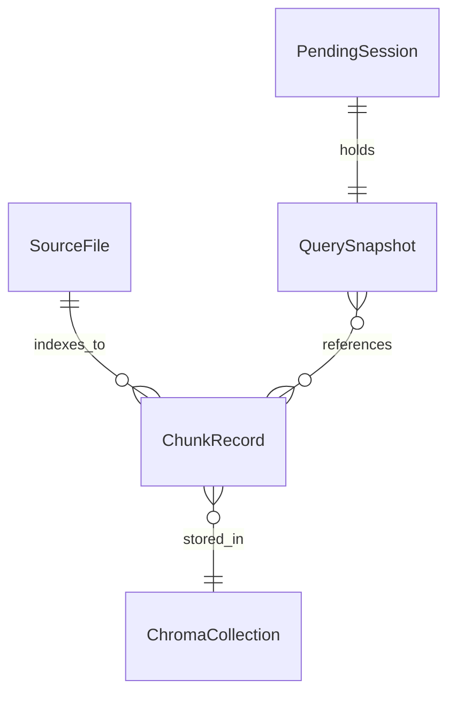

# 데이터베이스 설계

**기준**: [architecture-planning.md](./architecture-planning.md) AR-7, [domain-modeling.md](./domain-modeling.md)  
**결론**: MVP **관계형 DB 없음** — 파일 SSOT + Chroma + in-memory session

---

## 저장소 개요

| 저장소 | 역할 | 기술 | MVP |
|--------|------|------|-----|
| **소스 파일** | SSOT 콘텐츠 | `backend/data/sources/**/*.md` | Must |
| **벡터 인덱스** | Chunk embedding 검색 | Chroma persistent (`backend/data/index/`) | Must |
| **Pending 세션** | confirm 2차 턴 | In-process dict + TTL | Must |
| **HF 모델 캐시** | LLM/임베딩 가중치 | `~/.cache/huggingface/` | Must |
| **SQL / Postgres** | 사용자·일정·커뮤니티 | — | **Non-Scope** |

---

## 논리 엔티티 (RDBMS 없음)

도메인 엔티티는 **파일·인덱스·메모리**에 매핑.

| 도메인 엔티티 | 영속화 |
|---------------|--------|
| SourceDocument | `.md` + YAML frontmatter |
| Chunk | Chroma `documents` + `metadatas` + `embeddings` |
| VectorIndex | Chroma collection `ku_intl_docs` |
| Query | 요청마다 transient (PendingSession에 스냅샷) |
| PendingSession | RAM, key=`pending_id` |
| ChatResponse | HTTP only, 미저장 |

---

## 소스 파일 스키마 (frontmatter v2)

파일 = 1 SourceDocument. Git이 버전·감사 추적.

| 필드 | 타입 | 필수 | 인덱스 용도 |
|------|------|------|-------------|
| `doc_id` | string | yes | stable id |
| `source_url` | string | yes | citation |
| `source_title` | string | yes | citation, chunk meta |
| `source_language` | `ko` | yes | MVP 고정 |
| `curated_language` | `ko` | yes | MVP 고정 |
| `category` | enum string | yes | visa, enrollment, housing, course, … |
| `target_audience` | string | 권장 | filter (2차) |
| `sensitive_topic` | enum | yes | safety rules |
| `updated_at` | ISO date | yes | ops |
| `curation_status` | enum | yes | human_curated |
| `translation_strategy` | string | yes | answer_time_translation |
| `preserve_korean_terms` | bool | 권장 | prompt |
| `preserve_terms` | string[] | 권장 | generation |

**본문**: 한국어 markdown; `##` / `다.` 절 → Chunk.text

---

## Chroma 컬렉션 스키마

**Collection**: `ku_intl_docs`  
**Space**: cosine (`metadata: hnsw:space = cosine`)

| Chroma 필드 | 출처 |
|-------------|------|
| `id` | hash(`doc_id`, chunk index, text prefix) |
| `document` | Chunk.text (Korean) |
| `embedding` | multilingual MiniLM |
| `metadata.source_id` | path relative to sources/ |
| `metadata.doc_id` | frontmatter |
| `metadata.title` | source_title |
| `metadata.lang` | `ko` |
| `metadata.section_title` | chunking |
| `metadata.source_url` | frontmatter |
| `metadata.category` | frontmatter |
| `metadata.sensitive_topic` | frontmatter |
| `metadata.label` | optional legacy |

**인덱스 (Chroma)**: embedding ANN; `category` / `doc_id` 메타 필터 = Should (2차).

---

## Pending 세션 저장소 (in-memory)

| 필드 | 타입 | TTL |
|------|------|-----|
| `pending_id` | UUID string | key |
| `query` | serialized Query | 기본 600s |
| `selected_context` | chunk list snapshot | 동일 |
| `response_lang` | lang code | 동일 |
| `created_at` | timestamp | eviction |

**규모 한계**: 단일 인스턴스 MVP; 다중 replica → Redis (Could).

---

## 관계 (논리)

---

## 제약

| 규칙 | 적용 |
|------|------|
| 저장소 내 `doc_id` 유일 | 콘텐츠 리뷰 + lint 스크립트 (Should) |
| `source_url` HTTPS | frontmatter 검증 (Should) |
| md에 PII 없음 | 편집 정책 |
| md 변경 후 reindex | ops runbook |
| Chunk text 최대 ~600자 | chunking.py |

---

## 마이그레이션 계획

| 버전 | 작업 |
|------|------|
| v0 → v1 | frontmatter v2 필드 추가; force reindex |
| index rebuild | `python scripts/build_index.py` 또는 `POST /admin/reindex` |
| model change | 전체 청크 re-embed (새 EMBEDDING_MODEL) |

**시드**: `data/sources/` 하위 Must 한국어 md 4건 (Visa, Enrollment, Housing, Course).

**롤백**: md git revert + 이전 `data/index/` 백업 복원.

---

## 데이터 무결성 리스크

| 리스크 | 완화 |
|--------|------|
| 인덱스 vs md 불일치 | `GET /health` indexed_chunks; md PR 후 CI 검사 |
| doc_id 중복 | pre-commit grep |
| preserve_terms 오류 | QA 샘플 답변 |
| Chroma 손상 | force reindex 전 index 디렉터리 백업 |
| 재시작 시 세션 소실 | confirm UX: 질문 다시 안내 |
| 공식 웹 변경·md 구버전 | `updated_at` + 정기 콘텐츠 리뷰 |

---

## PII 및 보존

| 데이터 | 저장? | 보존 |
|--------|-------|------|
| 사용자 계정 | No | — |
| 챗 메시지 (서버) | MVP: 로그 지양 | — |
| PendingSession | RAM, TTL | 600s |
| md / Chroma | Yes | 삭제 전까지 |

---

## 2차 (post-MVP) 옵션

- Postgres: 사용자, 챗 기록(opt-in), 분석  
- Object storage: md CMS export  
- Redis: pending session, rate limit  

**다음**: [task-breakdown.md](./task-breakdown.md)
