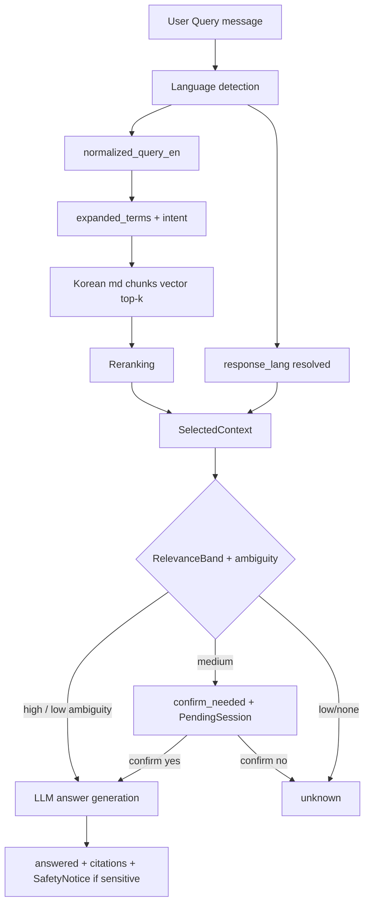
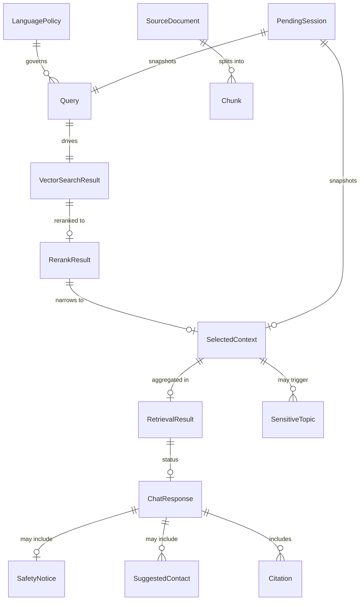
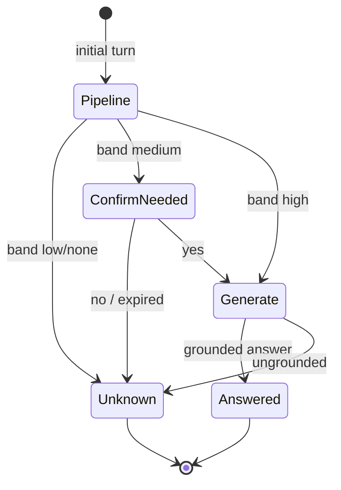

# 도메인 모델

**버전**: 2026-06-02 (Skill 5 보강 — English-first multilingual RAG)  
**기준**: [mvp-scope-planning.md](./mvp-scope-planning.md), [requirements-decomposition.md](./requirements-decomposition.md)  
**범위**: KU **RAG FAQ 챗봇** — 무로그인 MVP, 풀앱 개념 제외

---

## 제품 전제 (MVP)

| 단계 | 설명 |
|------|------|
| **공식 원천** | 학교 **한국어 공식 웹페이지·안내문** (실시간 크롤 아님) |
| **SSOT** | 담당자가 정리한 **한국어 Markdown** (`.md` + frontmatter) |
| **검색** | 한국어 청크 **벡터 검색** (+ 영어 정규화·한국어 행정어 확장) |
| **답변** | LLM이 **`response_lang`** 으로 생성; **한국어 행정 키워드는 English + Korean 병기** |

```text
공식 KO 웹 → (사람 정리) → Korean .md → Chunk → VectorIndex
User Query (any supported lang) → retrieval → SelectedContext → LLM → multilingual answer + citations
```

---

## 핵심 개념

| 개념 | 설명 |
|------|------|
| **국제 유학생** | 1차 사용자. MVP **무로그인·익명**. |
| **LanguagePolicy** | English-first 응답·검색 정규화·폴백·한국어 용어 보존 규칙. |
| **SourceDocument** | 공식 안내를 기준으로 한 **문서 단위**; MVP 본문은 **human-curated Korean `.md`**. |
| **Chunk** | Korean md에서 분할된 **검색·인덱스 단위** (원문 한국어). |
| **Query** | 사용자 질문 + 언어 감지·정규화·의도·애매도. |
| **Retrieval pipeline** | vector top-k → **Rerank** → **SelectedContext** (LLM 입력). |
| **ChatResponse** | `answered` \| `confirm_needed` \| `unknown` + citations. |
| **Citation** | 공식 `source_url`·제목·발췌 — 원문(한국어 페이지) 확인용. |
| **PendingSession** | `confirm_needed` 2차 턴 스냅샷. |
| **SensitiveTopic** | 비자·의료·법률 등 — 답변 톤·안전 문구 트리거. |

---

## LanguagePolicy (값 객체 / 정책)

| 필드 | 값 | 설명 |
|------|-----|------|
| `default_response_language` | `en` | UI 초기값·낮은 신뢰도·미지원 시 **폴백 응답 언어**. |
| `supported_response_languages` | `en`, `ko`, `zh`, `ja` | 사용자 **답변** 후보. |
| `search_normalization_language` | `en` | `normalized_query_en` 생성 기본 언어. |
| `rag_source_language` | `ko` | 인덱스 청크 **원문**은 한국어 md. |
| `input_language_detection` | auto | `detected_lang` — 규칙/모델(구현은 architecture 단계). |
| `response_language_rule` | follow detected or selected | `response_lang` = 사용자 선택 UI lang **우선**; 없으면 `detected_lang`; 신뢰도 낮으면 `en`. |
| `korean_term_preservation` | required | 중요 행정어: **English (한국어원문)** 형태 유지. |

**폴백 순서 (응답 언어)**

1. 사용자가 명시 선택한 UI/API `lang` (신뢰 있음)  
2. `detected_lang` (confidence ≥ 임계값)  
3. `default_response_language` (`en`)

**한국어 행정 키워드 보존 (예)**

- Alien Registration Card (외국인등록증)  
- Immigration Office (출입국·외국인청)  
- Status of Stay (체류자격)  
- Certificate of Admission (표준입학허가서)

`preserve_terms`는 SourceDocument frontmatter에서 문서별로 정의; LanguagePolicy는 **전역 기본 동작**을 고정.

---

## 엔티티

### 국제 유학생 (Actor — 비영속)

| 속성 | 설명 |
|------|------|
| (MVP) | 계정 없음. 기기에서 **UI 언어 선호**만 유지 가능. |

---

### SourceDocument (가이드 소스 문서)

공식 웹/안내문 **1건**에 대응. MVP에서는 **공식 한국어 페이지를 사람이 정리한 한국어 `.md`** 가 SSOT.

| 속성 | 타입 | 설명 |
|------|------|------|
| `doc_id` | string | 안정 식별자 (frontmatter, 파일명과 정합) |
| `source_url` | string | **공식** 한국어 웹 URL (citation·사용자 원문 확인) |
| `source_title` | string | 공식 제목 (예: 외국인등록 안내) |
| `source_language` | lang code | 원 공식 매체 언어 — MVP **`ko`** |
| `curated_language` | lang code | 정리본 본문 언어 — MVP **`ko`** |
| `category` | string | 예: `visa`, `enrollment`, `housing`, `course` |
| `target_audience` | string | 예: `international_students` |
| `sensitive_topic` | SensitiveTopic | 민감 분류 (아래 enum) |
| `updated_at` | date | 정리·검수 기준일 |
| `curation_status` | enum | 예: `draft` \| `human_curated` \| `reviewed` |
| `translation_strategy` | enum | MVP: **`answer_time_translation`** (별도 en/zh/ja md 필수 아님) |
| `preserve_terms` | string[] | 답변 시 English+Korean 병기할 한국어 용어 목록 |
| `body` | markdown | frontmatter 제외 본문 (한국어) |
| `storage_path` | string? | `data/sources/...` 상대 경로 (구현 세부) |

**MVP와 이전 MoSCoW 정합**: 인덱스 **원문은 Korean md 중심**; 영어/중/일 **별도 SourceDocument 파일**은 Should(선택 보조)이며, MVP Must는 **answer-time 다국어 생성**으로 충족.

#### Markdown frontmatter 예시

```yaml
---
doc_id: alien-registration
source_url: "https://official-school-page..."
source_title: "외국인등록 안내"
source_language: "ko"
curated_language: "ko"
target_audience: "international_students"
category: "visa"
sensitive_topic: "immigration"
updated_at: "2026-06-02"
curation_status: "human_curated"
translation_strategy: "answer_time_translation"
preserve_korean_terms: true
preserve_terms:
  - "외국인등록증"
  - "출입국·외국인청"
  - "체류자격"
  - "표준입학허가서"
---

## 1. 외국인 등록

다. 제출 서류
- 외국인등록신청서
- 여권
...
```

---

### Chunk (인덱스 청크)

| 속성 | 타입 | 설명 |
|------|------|------|
| `chunk_id` | string | 인덱스 내 ID |
| `text` | string | **한국어** 본문 조각 |
| `doc_id` | string | → SourceDocument |
| `section_title` | string? | 절 경로 (예: `외국인 등록 > 다. 제출 서류`) |
| `source_url`, `source_title` | string | denormalized citation용 |
| `category`, `sensitive_topic` | string | 검색·안전 규칙용 메타 |
| `preserve_terms` | string[] | 문서에서 상속 |
| `embedding` | vector | 저장소 내부 |

---

### Query (질의 — 확장)

| 속성 | 타입 | 설명 |
|------|------|------|
| `message` | string | 사용자 **원문** 질문 |
| `detected_lang` | lang code? | 자동 감지 입력 언어 |
| `detection_confidence` | float? | 0~1; 낮으면 `response_lang` → `en` |
| `response_lang` | lang code | **답변 생성** 언어 (UI 선택 또는 detected, 폴백 en) |
| `normalized_query_en` | string | 검색 정확도용 **영어 정규화** 질문 |
| `expanded_terms` | string[] | 한국어 행정용어·동의어·intent 확장 (검색 쿼리 보강) |
| `intent` | QueryIntent | `document_list` \| `procedure` \| `deadline` \| `general` |
| `ambiguity_level` | enum | `low` \| `medium` \| `high` — 검색·confirm 힌트 |

**QueryIntent**: 규칙 분류; 답변 경로 분기가 아니라 **검색·프롬프트·expanded_terms** 보강.

**ambiguity_level ↔ RelevanceBand (도메인 힌트)**

| ambiguity_level | 전형적 API 동작 |
|-----------------|----------------|
| `low` + high band | 바로 LLM |
| `medium` 또는 medium band | `confirm_needed` 검토 |
| `high` 또는 low/none band | `unknown` 우선 |

---

### Retrieval pipeline entities

#### VectorSearchResult (1차 검색)

| 속성 | 설명 |
|------|------|
| `candidates` | RetrievedChunk[] — vector **top-k** (한국어 청크) |
| `search_query` | `normalized_query_en` + `expanded_terms` 반영된 실제 검색 문자열 |
| `best_distance` | 최상위 cosine distance |

#### RerankResult (재순위)

| 속성 | 설명 |
|------|------|
| `ranked_chunks` | RetrievedChunk[] — reranker 적용 후 순서 |
| `rerank_scores` | float[]? | 구현 선택 (cross-encoder, LLM, heuristic) |
| `dropped_count` | int | top-k에서 탈락한 수 |

**역할**: vector만으로는 부정확한 후보를 **걸러·재정렬**; LLM에 넣기 전 단계.

#### SelectedContext (LLM 입력 컨텍스트)

| 속성 | 설명 |
|------|------|
| `chunks` | RetrievedChunk[] — **실제 LLM에 전달**하는 소수 청크 (≤ context budget) |
| `language_policy` | LanguagePolicy 스냅샷 |
| `response_lang` | 답변 언어 |
| `preserve_terms_union` | 선택 청크·문서에서 합친 보존 용어 |
| `sensitive_topics` | SensitiveTopic[] — 포함 청크에서 집계 |

**구분**: `VectorSearchResult.candidates` (넓음) ≠ `SelectedContext.chunks` (좁고 최종).

#### RetrievalResult (집계 — API·밴드)

| 속성 | 설명 |
|------|------|
| `vector_search` | VectorSearchResult |
| `rerank` | RerankResult? |
| `selected_context` | SelectedContext? |
| `band` | RelevanceBand | `high` \| `medium` \| `low` \| `none` |

---

### SensitiveTopic, SafetyNotice, SuggestedContact

**SensitiveTopic** (enum):

`immigration` \| `medical` \| `legal` \| `employment` \| `financial` \| `housing` \| `academic` \| `general`

| 개념 | 설명 |
|------|------|
| **SafetyNotice** | 민감 주제 답변에 붙는 **비단정·면책·공식 확인** 문구 블록 (`response_lang`으로 생성, 정책 템플릿) |
| **SuggestedContact** | 국제처·출입국·보건소 등 **공식 부서 연락** 제안 (청크·메타에 있을 때만; 없으면 일반 국제처 안내) |

SourceDocument.`sensitive_topic`이 Chunk·SelectedContext로 전파 → LLM·SafetyNotice 트리거.

---

### ChatTurn / PendingSession / ChatResponse / Citation

**유지 (MVP)**

| 엔티티 | 핵심 |
|--------|------|
| **ChatTurn** | `initial` \| `confirm`; Query 스냅샷 포함 |
| **PendingSession** | `pending_id`, **전체 Query**, `selected_context` 또는 `retrieval` 스냅샷, `response_lang`, TTL |
| **ChatResponse** | `status`, `answer`, `citations`, `model_used`, `pending_id`, `confirm_prompt`; (선택) `safety_notice` |
| **Citation** | `source_url`, `source_title`, `excerpt`, `doc_id`; URL dedupe |

**AnswerStatus**: `answered` \| `confirm_needed` \| `unknown` — 변경 없음.

**LLMAnswer**: `text`, `grounded`, `korean_terms_preserved`, `includes_safety_notice`.

---

### ReindexOperation (운영)

SourceDocument(한국어 md) 변경 → VectorIndex 재구축. `/chat` 실시간 fetch 없음.

---

## 검색 흐름 (end-to-end)



**단계 설명**

1. **User Query** — `message` 수신; UI `lang` 힌트 optional.  
2. **Language detection** — `detected_lang`, `detection_confidence`.  
3. **response_lang** — LanguagePolicy에 따라 결정 (폴백 `en`).  
4. **normalized_query_en** — 검색 정규화 (English-first retrieval).  
5. **expanded_terms** — 한국어 행정어·동의어·intent 키워드 (예: 제출서류, 외국인등록).  
6. **Korean md chunks 검색** — VectorIndex; 청크 본문은 **한국어**.  
7. **vector top-k retrieval** — `VectorSearchResult.candidates`.  
8. **reranking** — `RerankResult`.  
9. **selected context** — LLM prompt용 최종 청크 집합.  
10. **LLM answer generation** — `response_lang`으로 작성; `preserve_terms` 병기; 민감 시 SafetyNotice.

---

## 관계



---

## 도메인 규칙

### DR-1 출처·신뢰 (faithfulness) — 유지

| ID | 규칙 |
|----|------|
| DR-1.1 | 답변은 **SelectedContext 청크(한국어 원문)** 에만 근거. |
| DR-1.2 | low/none band → **unknown**; 무출처 행정 답 금지. |
| DR-1.3 | LLM `__UNKNOWN__` → unknown. |
| DR-1.4 | Citation **source_url** dedupe. |
| DR-1.5 | **deadline, fee, required documents** — 청크에 없으면 **생성 금지** (환각 방지). |

### DR-2 검색·파이프라인

| ID | 규칙 |
|----|------|
| DR-2.1 | `/chat` 시 **공식 URL 실시간 fetch 없음** — 인덱스된 Korean md만. |
| DR-2.2 | 검색 정규화 기본 **`normalized_query_en`**; 인덱스 텍스트는 **한국어**. |
| DR-2.3 | `expanded_terms`로 한국어 행정어·intent 보강. |
| DR-2.4 | **vector top-k ≠ LLM context** — 반드시 SelectedContext로 축소. |
| DR-2.5 | `document_list` intent → 제출서류 관련 청크 우선. |

### DR-3 확인 턴 — 유지

| ID | 규칙 |
|----|------|
| DR-3.1 | medium band 또는 `ambiguity_level=medium` → **confirm_needed** 가능. |
| DR-3.2 | confirm no / PendingSession 만료 → unknown. |
| DR-3.3 | PendingSession에 **Query + SelectedContext(또는 retrieval)** 스냅샷. |

### DR-4 LanguagePolicy

| ID | 규칙 |
|----|------|
| DR-4.1 | `default_response_language = en`. |
| DR-4.2 | `response_lang` = UI 선택 > detected (conf 높음) > **en**. |
| DR-4.3 | `search_normalization_language = en` for `normalized_query_en`. |
| DR-4.4 | RAG 원문 청크는 **한국어 md**; 답변은 `response_lang`. |
| DR-4.5 | `preserve_terms` / 정책 목록 용어 → **English (한국어)** 병기; 번역만으로 대체 금지. |

### DR-5 민감 주제·안전 (신규)

| ID | 규칙 |
|----|------|
| DR-5.1 | **SensitiveTopic** 해당 시 **단정형 행정 답변 금지** (must/must not 대신 안내·확인 권장). |
| DR-5.2 | **immigration, medical, legal, employment, financial** 등 — **SafetyNotice** + **SuggestedContact**(메타·청크에 근거 있을 때). |
| DR-5.3 | **응급** — emergency 연락처·공식 안내 **우선**; LLM 추측 금지. |
| DR-5.4 | 청크에 없는 기한·수수료·서류 목록 **추가 생성 금지** (DR-1.5와 동일). |

### DR-6 소스·인덱스 — 유지·수정

| ID | 규칙 |
|----|------|
| DR-6.1 | SourceDocument = **human-curated Korean md**; `curation_status` 최소 `human_curated` 권장. |
| DR-6.2 | md 변경 → ReindexOperation 필수. |
| DR-6.3 | `indexed_chunks = 0` → unknown/503. |

### DR-7 개인정보·계정 — 유지

| ID | 규칙 |
|----|------|
| DR-7.1 | **무로그인** MVP. |
| DR-7.2 | PII 로그 최소; Should: 입력 경고. |

---

## State: AnswerStatus (유지)



---

## 용어집

| English | 한국어 | 설명 |
|---------|--------|------|
| LanguagePolicy | 언어 정책 | English-first·폴백·용어 보존 |
| SourceDocument | 소스 문서 | 공식 안내 기준; MVP Korean curated md |
| Curated markdown | 정리 마크다운 | 사람이 공식 KO 페이지에서 작성 |
| normalized_query_en | 영어 정규화 질의 | 검색용 |
| expanded_terms | 검색 확장어 | 한국어 행정어·동의어 |
| SelectedContext | 선택 컨텍스트 | LLM에 실제 전달되는 청크 |
| RerankResult | 재순위 결과 | top-k 후보 정제 |
| preserve_terms | 보존 용어 | English (한국어) 병기 |
| answer_time_translation | 응답 시 번역 | 별도 en md 없이 LLM 다국어 답변 |
| SensitiveTopic | 민감 주제 | immigration, medical, … |
| SafetyNotice | 안전 안내 문구 | 비단정·공식 확인 |
| SuggestedContact | 권장 연락처 | 국제처 등 (근거 있을 때) |

---

## 범위 외 (도메인 모델 밖)

OnboardingState, Push, CampusMap, Community, UserAccount/SSO, 실시간 웹 크롤, 별도 영어 md Must(→ answer-time으로 대체).

---

**Skill 5 완료** — 다음은 `architecture-planning` (별도 승인·실행). DB 설계·코드 작성은 하지 않음.
