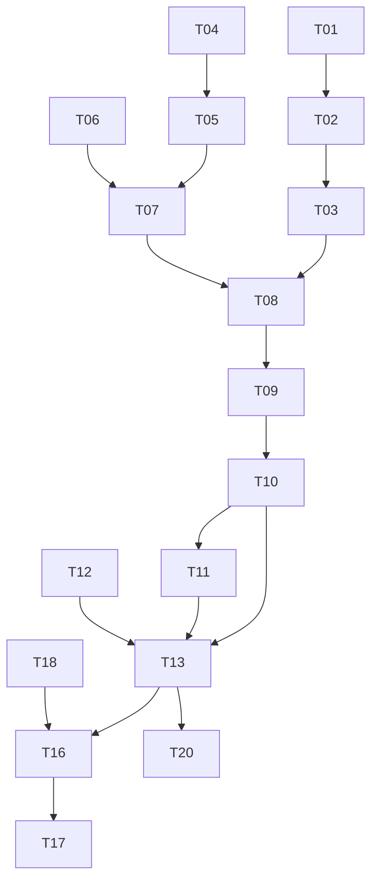

# 작업 분해 (Task Breakdown)

**기준**: MVP Must, [architecture-planning.md](./architecture-planning.md), [database-design.md](./database-design.md)  
**원칙**: 1 PR ≈ 1 task; 구현 전 [implementation-prompt-writer.md](./implementation-prompt-writer.md) 해당 Prompt 승인

---

## 단계 맵

| 단계 | Task | 목표 |
|------|------|------|
| P0 | T01–T03 | 한국어 md + 인덱스 |
| P1 | T04–T09 | Query + 검색 파이프라인 |
| P2 | T10–T12 | 생성 + safety |
| P3 | T13–T15 | API + 세션 |
| P4 | T16–T18 | Expo 클라이언트 |
| P5 | T19–T20 | 운영, 테스트, 파일럿 |

---

## 작업 표

| ID | 작업 | 범위 | 선행 | 완료 기준 | 테스트 |
|----|------|------|------|-----------|--------|
| **T01** | 한국어 md 4섹션 + frontmatter v2 | Visa, Enrollment, Housing, Course `.md`, `preserve_terms` | — | 4 files; valid YAML; `updated_at` | 수동 리뷰 |
| **T02** | Frontmatter loader v2 | indexer meta에 `doc_id`, `sensitive_topic`, `preserve_terms` | T01 | Index builds; meta in Chroma | unit: parse sample |
| **T03** | 인덱스 구축 및 health | `build_index`, `/health` indexed_chunks>0 | T02 | CLI + API reindex | `GET /health` |
| **T04** | 언어 감지 + response_lang | `langdetect`, confidence 0.7, UI lang 우선 | — | Unit: en/ko/zh/ja 샘플 | unit |
| **T05** | Query normalizer (`normalized_query_en`) | en이면 copy; 그 외 검색 전용 EN | T04 | KO 입력 시 로그에 EN 문자열 | unit + 샘플 3건 |
| **T06** | Intent + term expander | `intent`, `expanded_terms`, `ambiguity_level` | — | document_list에 제출서류 terms | unit: intent tests |
| **T07** | Query builder | 단일 `Query` dataclass 조립 | T04–T06 | 한 함수가 full Query 반환 | unit |
| **T08** | 벡터 검색 + banding | embed search_text; HIGH/LOW 임계값 | T03, T07 | top-k 반환; low→empty band | integration |
| **T09** | 휴리스틱 rerank + SelectedContext | rerank + ≤4 chunks 선택 | T08 | 제출서류 질의 순위 상승 | integration |
| **T10** | Generator + LanguagePolicy prompt | `response_lang`, preserve_terms, `__UNKNOWN__` | T09 | EN 답변에 ARC (한국어) | manual 5 queries |
| **T11** | SafetyNotice + SensitiveTopic | 주제별 템플릿; DR-5 | T10 | immigration 답에 disclaimer | manual |
| **T12** | answer_composer i18n | unknown/confirm 4개 언어 | — | ko/en/zh/ja 문자열 | snapshot/manual |
| **T13** | FastAPI `/chat` initial + confirm | status 3-way; pending TTL | T07–T11, T12 | E2E confirm yes/no | integration |
| **T14** | Citations dedupe | source_url 유일 | T13 | 중복 URL 제거 | unit |
| **T15** | CORS + config env | `.env.example`, MODEL_ID 1.5B | T13 | Expo LAN 호출 성공 | manual device |
| **T16** | Expo 챗 UI | send, 답변/citations 표시 | T13 | message 왕복 | E2E |
| **T17** | Expo confirm + unknown UI | pending_id 흐름 | T16 | medium→confirm→answered | E2E |
| **T18** | Expo i18n 4언어 + lang picker | strings.ts; API에 `lang` 전달 | T16 | 언어 전환 시 UI 갱신 | manual |
| **T19** | RAG_SOURCES + reindex runbook | 콘텐츠 팀용 문서 | T03 | 문서 완료 | review |
| **T20** | 샘플 Q&A QA 시트 | ≥10문항 AC-1~3 | T01, T13 | 시트 통과율 | 파일럿 준비 |

---

## 의존성 그래프 (요약)

---

## Non-Scope (명시적 제외 작업)

- SQL 스키마, 사용자 인증, Push, 대시보드, 지도, 커뮤니티  
- `/chat` 실시간 URL fetch  
- Cross-encoder rerank (→ 1.x task)  
- 운영 K8s (→ deploy skill)

---

## 권장 PR 순서

1. T01 + T02 + T03 (콘텐츠 + 인덱스)  
2. T04–T09 (RAG 검색 spine)  
3. T10–T12 (생성)  
4. T13–T15 (API)  
5. T16–T18 (모바일)  
6. T19–T20 (문서 + QA)

**다음**: task 선택 → Implementation Prompt 작성 → 구현.
